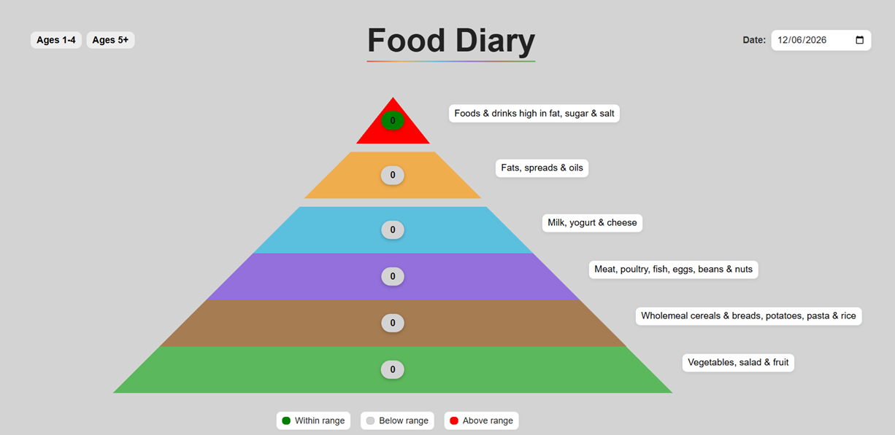

# Interactive Food Pyramid

This is a small web application I built for one of my university web development assignments.

The idea is to keep track of how many servings you've eaten from each level of the Irish Food Pyramid throughout the day. As you add or remove servings, the pyramid updates automatically and shows whether you're below, within, or above the recommended guidelines for your age group.

## Screenshot

## Features

* Add and remove servings from each food group
* Switch between Ages 1–4 and Ages 5+ recommendations
* Colour-coded indicators showing your progress
* Shelves grow and shrink based on the number of servings
* Date selector for daily tracking
* Responsive layout

## Built With

* HTML
* CSS
* JavaScript

## What I Learned

This project helped me get more comfortable with JavaScript, DOM manipulation, event handling, and creating interactive web pages without using any frameworks.
